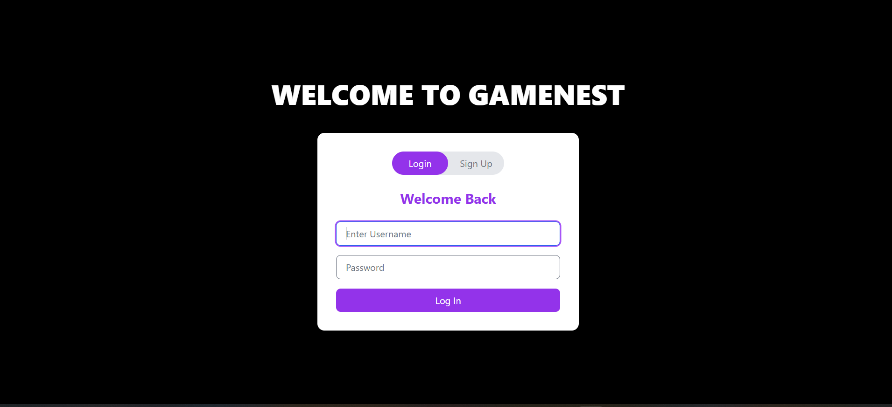
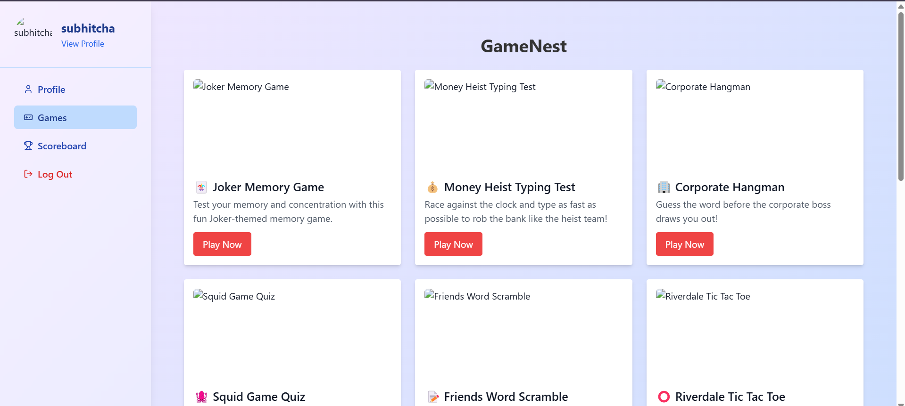
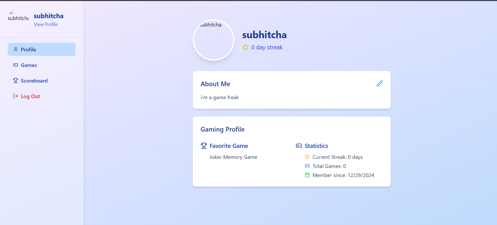
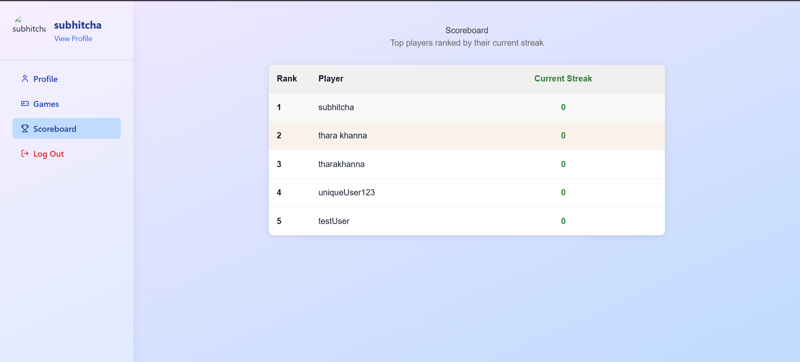
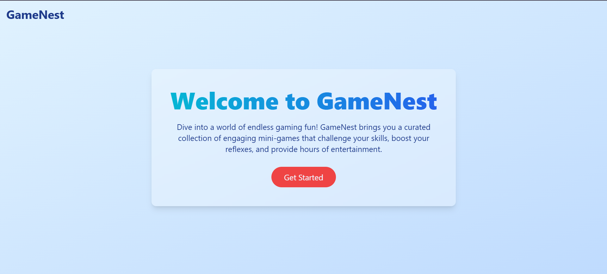

<<<<<<< HEAD
<<<<<<< HEAD
### Build for Production

```bash
# Create optimized production build
npm run build

# Deploy to GitHub Pages
npm run deploy
```

---

## 🔐 Environment Variables

Create a `.env` file in the root directory:

```env
REACT_APP_BACKEND_URL=http://localhost:5000
SENDGRID_API_KEY=your_sendgrid_api_key
```

> ⚠️ Never commit your `.env` file. It is already listed in `.gitignore`.

---

## 📸 Screenshots

| Page | Preview |
|---|---|
| 🏠 Home / Landing Page | *(animated particle background, hero section)* |
| 🔐 Authentication | *(login & register with JWT)* |
| 🎮 Game Library | *(10 themed game cards with filters)* |
| 👤 Player Profile | *(stats, streaks, favorite game)* |
| 🏆 Leaderboard | *(per-game filter, medal rankings)* |

---

## 🤝 Contributing

Contributions are welcome!

1. Fork this repository
2. Create a new branch: `git checkout -b feature/your-feature-name`
3. Make your changes and commit: `git commit -m "feat: add your feature"`
4. Push to your fork: `git push origin feature/your-feature-name`
5. Open a Pull Request

---

## 📄 License

This project was built as a 5th Semester academic project.  
Feel free to fork and build upon it!

---

<div align="center">
  <strong>GameNest © 2024 — Built with ❤️ using React.js</strong>
</div>
=======
### Frontend Setup
```bash
# Navigate to frontend directory
cd frontend

# Install dependencies
npm install

# Start the React app
npm run dev
```

## Screenshots
Here are some images showcasing the platform:

### Authentication Page


### Game Library


### User Profile Page


### Scoreboard


### Front Page


## Contributing
Contributions are welcome! Feel free to fork this repository, create a new branch, and submit a pull request.


