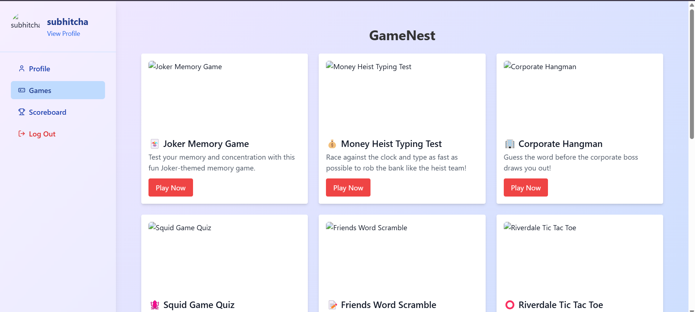

# GameNest - Online Gaming Platform

## Overview
GameNest is a feature-rich gaming platform designed and deployed using React.js. It offers a game library, tournaments, and leaderboards for an interactive user experience. The frontend is deployed on Netlify, ensuring scalability and fast performance. The backend is powered by MongoDB and secured with JWT-based authentication.

## Features
- 🎮 **Game Library** – Browse and play various games seamlessly.
- 📊 **Leaderboard** – Track player rankings and scores.
- 🔐 **User Authentication** – Secure login and registration using JWT authentication.
- 🚀 **Optimized Navigation** – Implemented using React Router for a smooth user experience.
- 📦 **State Management** – Context API ensures efficient data handling.

## Technologies Used
- **Frontend:** React.js, React Router, Context API
- **Backend:** Node.js, Express.js, MongoDB
- **Authentication:** JWT-based authentication
- **Deployment:** Netlify (Frontend), Render(Backend)
- **Version Control:** Git & GitHub

## Setup Instructions

### Backend Setup
```bash
# Navigate to backend directory
cd backend

# Install dependencies
npm install

# Start the server
npm start
```

### Frontend Setup
```bash
# Navigate to frontend directory
cd frontend

# Install dependencies
npm install

# Start the React app
npm run dev
```

## Screenshots
Here are some images showcasing the platform:

### Authentication Page


### Game Library


### User Profile Page


### Scoreboard


### Front Page


## Contributing
Contributions are welcome! Feel free to fork this repository, create a new branch, and submit a pull request.

